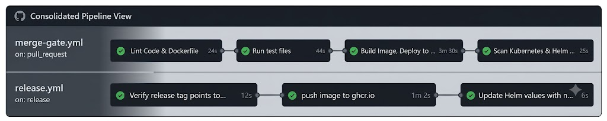
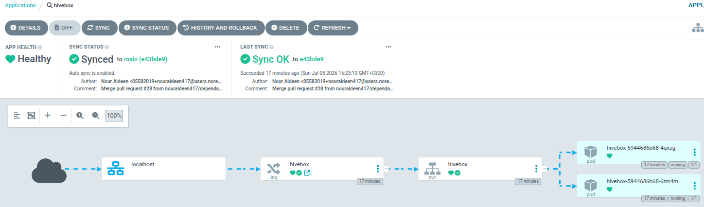
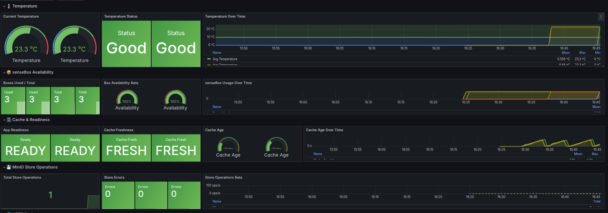
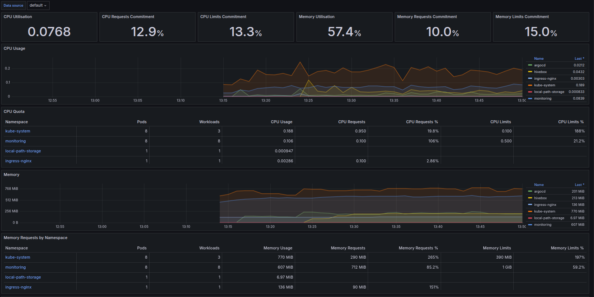
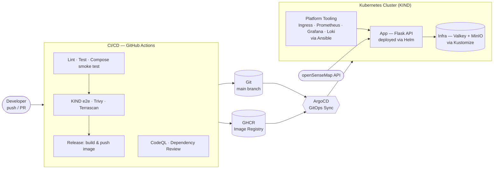

<div align="center">

# 🐝 HiveBox

**A production-grade, end-to-end DevOps learning project** — a Flask REST
API that aggregates real-time environmental data from IoT sensors, built
and shipped through a complete Kubernetes + GitOps + CI/CD stack, entirely
self-hosted with no external cloud dependencies.

[](https://github.com/nouraldeen417/DevOps-HiveBox-Project-/actions/workflows/branch-checks.yml)
[](https://github.com/nouraldeen417/DevOps-HiveBox-Project-/actions/workflows/merge-gate.yml)
[](https://github.com/nouraldeen417/DevOps-HiveBox-Project-/actions/workflows/codeql.yml)
[](https://github.com/nouraldeen417/DevOps-HiveBox-Project-/actions/workflows/security-audit.yml)


</div>

---

## What is this?

HiveBox is a beekeeping-focused API built around
[openSenseMap](https://opensensemap.org/), an open IoT sensor data
platform. It reports average temperature across a set of real senseBoxes,
flags whether conditions are too cold, good, or too hot for bees, and
archives readings for later analysis.

But the API itself is only half the point. **This project exists to
practice — and demonstrate — the full DevOps lifecycle end to end**: not
just writing an app, but designing how it's tested, containerized,
deployed, observed, secured, and continuously delivered, the way a real
production system would be. Every design decision below — from why Helm is
scoped to only the app, to why Trivy runs where it does, to why secrets
never touch Git — was made deliberately, not by default.

---

## 📸 Screenshots

<!-- Replace these with real screenshots from your setup — see docs/images/ -->

| CI/CD in action | GitOps in action |
|---|---|
|  |  |

| App Dashboard | Cluster Dashboard |
|---|---|
|  |  |

---

## Architecture


 

**The deliberate split:** Helm deploys *only* the app — not monitoring, not
ingress. Cluster tooling (Prometheus/Grafana/Loki/Nginx/ArgoCD) is
provisioned separately via Ansible, and the app's direct infra dependencies
(Valkey, MinIO) via Kustomize. Three tools, three narrow responsibilities,
instead of one chart trying to own everything.

---

## Why this project stands out

- **A genuinely tiered CI/CD pipeline, not a single do-everything workflow.**
  Every push gets fast feedback (~5 min: lint, test, Docker Compose smoke
  test). Only PRs to `main` pay for the expensive stuff — a real KIND
  cluster, Helm deploy, and Venom e2e tests, plus Trivy image scanning and
  Terrascan IaC scanning. Releases are a separate, deliberate trigger (a
  published GitHub Release), never automatic from a merge.
- **Security scanning at every layer, not just one checkbox.** Trivy scans
  the built image for CRITICAL CVEs before it can pass PR validation.
  Terrascan checks both the Kustomize and Helm manifests. CodeQL performs
  static analysis on every PR. Dependency Review blocks PRs that introduce
  vulnerable dependencies. OpenSSF Scorecard audits the repo's own
  supply-chain hygiene. Five different tools, five different threat
  surfaces.
- **Secrets never touch Git — enforced by design, not convention.** MinIO
  credentials and the app's TLS certificate are deliberately absent from
  every Helm value and every manifest. They're injected via manually
  created Kubernetes Secrets, so a `git clone` of this repo, on its own,
  can never leak a real credential.
- **Fully automated GitOps, with the guardrails that come with it.** ArgoCD
  runs with `prune` and `selfHeal` — Git is the only real source of truth,
  and both drift and manual `kubectl` edits get corrected automatically.
- **Dependabot handled without sacrificing rigor.** Dependency-bump PRs get
  fast checks (lint/test/compose) plus dependency-review — but skip the
  full KIND e2e suite, keeping routine bumps fast without skipping quality
  gates entirely.
- **A readiness probe that actually thinks about failure modes.** `/readyz`
  only fails if a majority of senseBoxes are unreachable *and* the cache
  has gone stale — so a flaky upstream API doesn't take healthy pods out of
  rotation.
- **Custom Prometheus metrics wired end-to-end**, from app code to
  auto-discovered Grafana dashboards via a Kustomize ConfigMap + sidecar
  pattern — no manual dashboard imports.

---

## Documentation Map

Each component has its own detailed doc. Start here to find what you need.

| Component | What it covers | Doc |
|---|---|---|
| App (Flask API) | Endpoints, config, caching/storage logic, local run + test commands | [`docs/app.md`](./docs/app.md) |
| Containers | Multi-stage Dockerfile, CI test compose setup | [`docs/containers.md`](./docs/containers.md) |
| Helm chart (`hivebox`) | App-only chart: values, templates, manual secret creation | [`docs/helm.md`](./docs/helm.md) |
| Kustomize | Valkey/MinIO infra, KIND cluster config, Grafana dashboard auto-loading | [`docs/kustomize.md`](./docs/kustomize.md) |
| Ansible | Cluster tooling provisioning (ingress, monitoring, Loki, ArgoCD) | [`docs/ansible.md`](./docs/ansible.md) |
| CI/CD | Full pipeline design and rationale, workflow by workflow | [`docs/ci-cd.md`](./docs/ci-cd.md) |
| GitOps / ArgoCD | Application manifest, sync policy, operational notes | [`docs/gitops.md`](./docs/gitops.md) |
| Runbook | Full local testing workflow, command by command | [`docs/runbook.md`](./docs/runbook.md) |

---

## Quick Start

For the complete local setup — cluster creation through teardown — follow
[`docs/runbook.md`](./docs/runbook.md). Short version:

```bash
kind create cluster --config k8s/kind-config.yaml
cd Ansible && ansible-playbook -i inventory/hosts.ini install.yml && cd ..
kubectl create namespace hivebox
# ...TLS + MinIO secrets — see docs/runbook.md
kubectl apply -k k8s/infrastructure/overlays/local/
kubectl apply -f gitops/hivebox-application.yaml
```

---

## Project Structure

```
.
├── src/                          # Flask app source
├── tests/                        # Unit tests
├── Dockerfile                    # Multi-stage build
├── docker-compose.test.yml       # CI functional check (Valkey + MinIO + app)
├── .github/
│   ├── workflows/                # branch-checks, merge-gate, codeql,
│   │                              #   dependency-review, release, security-audit
│   └── dependabot.yml
├── k8s/
│   ├── kind-config.yaml          # Local cluster config
│   ├── app/
│   │   ├── helm/hivebox/         # Helm chart — app only
│   │   └── app.old/              # Deprecated pre-Helm manifests
│   └── infrastructure/
│       ├── base/                 # Kustomize base: valkey/, minio/
│       └── overlays/local/       # Active overlay
├── dashboards/                   # Grafana dashboard Kustomize ConfigMaps
├── gitops/
│   └── hivebox-application.yaml  # ArgoCD Application manifest
├── Ansible/                      # Cluster tooling playbooks + roles
└── docs/                         # Component documentation (see map above)
```

---

## Roadmap

This project is developed in iterative phases — see the full roadmap for
context on what's built and what's next. Current focus: GitOps rollout on
`main`, dashboard refinement, and closing out the flagged items tracked
across the component docs above.